#  Master Technical Documentation: Task Management Ecosystem
[](https://jdk.java.net/25/)
[](https://spring.io/projects/spring-boot)
[]()

This project is a cutting-edge **Microservices Architecture** built using **Java 25**, **Spring Boot 4.0.x**, and **Spring Cloud 2025.1.0**. It is designed for maximum scalability, observability, and security.

## 1. System Architecture

| Service | Database Name | Why? |
| --- | --- | --- |
| **User Service** | `taskDB` | Holds sensitive identity data. |
| **Task Service** | `taskService` | Holds business requirements. |
| **Submission Service** | `taskSubmissionService` | Holds proof-of-work links. |

---

###  Why we used these specific components?

| Component | What is it? | Why we used it? (The "Work") |
| --- | --- | --- |
| **Eureka Server** | Service Registry | Like a **Phonebook**. Services change IPs and ports all the time. Eureka keeps a live list so services can find each other by name (e.g., `TASK-SERVICE`) instead of hardcoded numbers. |
| **API Gateway** | Single Entry Point | Like a **Receptionist**. It handles security (CORS) and routes requests. Without it, the frontend would have to talk to 4 different ports, which is a security nightmare. |
| **OpenFeign** | Declarative HTTP Client | It makes "Service-to-Service" communication look like a simple Java method call. It handles the heavy lifting of opening connections and parsing JSON. |
| **MongoDB** | NoSQL Database | Task Management data is "unstructured" (tasks have different tags, lengths, and fields). MongoDB stores data as JSON-like documents, which is faster and more flexible for this project. |
| **Zipkin** | Distributed Tracing | In microservices, one request can touch 5 services. If it’s slow, where is the delay? Zipkin shows you a visual timeline of the request's journey. |


---


The system is composed of five specialized microservices that interact via RESTful APIs, managed by a centralized discovery server and gateway.

* **API Gateway (Port 8090):** The single entry point for all client requests, providing centralized routing and CORS management.
* **Eureka Server (Port 8085):** The Service Registry that enables dynamic discovery and client-side load balancing.
* **User Service (Port 8081):** Manages authentication, authorization (JWT), and user profiles using MongoDB.
* **Task Service (Port 8082):** Handles task creation (Admin only), assignments, and task status tracking.
* **Submission Service (Port 8083):** Manages the workflow for user work submissions and coordinates with the Task Service for completion.

---
This is a complete, industrial-grade microservices architecture for a Task Management System. You have successfully combined several key Spring Cloud technologies:

1. **Spring Cloud Gateway (WebMVC):** The single entry point handling routing and CORS.
2. **Netflix Eureka:** Service discovery and registration.
3. **Spring Cloud OpenFeign:** Declarative REST clients for inter-service communication.
4. **Spring Security + JJWT:** Stateless authentication using JWTs passed between services.
5. **Resilience4j:** Circuit breaking for fault tolerance.
6. **Micrometer Tracing + Zipkin:** Distributed tracing for observability.
7. **MongoDB:** The database backend for each business service.

Here is the complete breakdown of your system architecture and its key data flows.

---

### 1. High-Level Microservices Architecture Diagram

This diagram illustrates how all the components you provided fit together into a cohesive system.

**Key Takeaways from your configuration:**

* **API Gateway (Port 8090):** Clients *only* talk to this port. They don't know about 8081, 8082, or 8083.
* **Service Registry (Port 8085):** All services register here so the Gateway and Feign clients can find them by name (e.g., `lb://USER-SERVICE`).
* **Inter-Service Security:** The JWT generated by the User Service is passed in the `Authorization` header during Feign calls (e.g., Task Service calling User Service) so the receiving service knows who initiated the action.
* **Database Isolation:** Each microservice has its own logical MongoDB database (`taskDB`, `taskService`, `taskSubmissionService`), adhering to the Database-per-Service pattern.

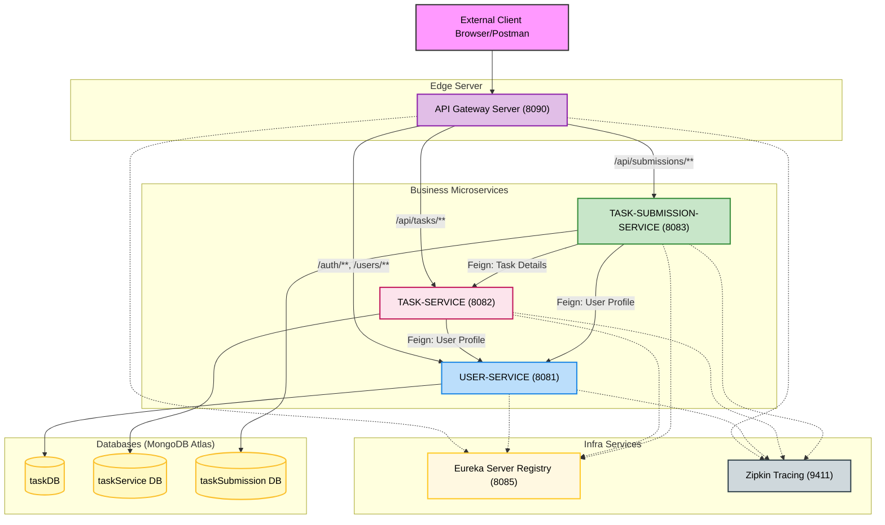
```mermaid
graph TD
    Client["External Client Browser/Postman"] --> Gateway

    subgraph Infra_Services ["Infra Services"]
        Eureka["Eureka Server Registry (8085)"]
        Zipkin["Zipkin Tracing (9411)"]
    end

    subgraph Edge_Server ["Edge Server"]
        Gateway["API Gateway Server (8090)"]
    end

    subgraph Business_Services ["Business Microservices"]
        UserService["USER-SERVICE (8081)"]
        TaskService["TASK-SERVICE (8082)"]
        SubService["TASK-SUBMISSION-SERVICE (8083)"]
    end

    subgraph Databases ["Databases (MongoDB Atlas)"]
        UserDB[(taskDB)]
        TaskDB[(taskService DB)]
        SubDB[(taskSubmission DB)]
    end

%% Gateway Routing
    Gateway -- "/auth/**, /users/**" --> UserService
    Gateway -- "/api/tasks/**" --> TaskService
    Gateway -- "/api/submissions/**" --> SubService

%% Service Registration & Discovery
    Gateway -.-> Eureka
    UserService -.-> Eureka
    TaskService -.-> Eureka
    SubService -.-> Eureka

%% Inter-Service Comm
    TaskService -- "Feign: User Profile" --> UserService
    SubService -- "Feign: User Profile" --> UserService
    SubService -- "Feign: Task Details" --> TaskService

%% Database Connections
    UserService --> UserDB
    TaskService --> TaskDB
    SubService --> SubDB

%% Tracing
    Gateway -.-> Zipkin
    UserService -.-> Zipkin
    TaskService -.-> Zipkin
    SubService -.-> Zipkin

%% UNIVERSAL THEME STYLING
    style Client fill:#f9f,stroke:#333,stroke-width:2px,color:#000
    style Gateway fill:#e1bee7,stroke:#8e24aa,stroke-width:2px,color:#000
    style Eureka fill:#fff8e1,stroke:#ffca28,stroke-width:2px,color:#000
    style Zipkin fill:#cfd8dc,stroke:#37474f,stroke-width:2px,color:#000
    style UserService fill:#bbdefb,stroke:#1e88e5,stroke-width:2px,color:#000
    style TaskService fill:#fce4ec,stroke:#c2185b,stroke-width:2px,color:#000
    style SubService fill:#c8e6c9,stroke:#388e3c,stroke-width:2px,color:#000
    style UserDB fill:#fff9c4,stroke:#fbc02d,stroke-width:2px,color:#000
    style TaskDB fill:#fff9c4,stroke:#fbc02d,stroke-width:2px,color:#000
    style SubDB fill:#fff9c4,stroke:#fbc02d,stroke-width:2px,color:#000
```

---

### 2. Sequence Diagram: Authentication Flow (Getting the JWT)

This flow demonstrates how a user signs in. This is the only time a request doesn't need an existing token.

* **Route:** `Gateway -> USER-SERVICE`
* **Config:** Matches gateway path `/auth/**`.

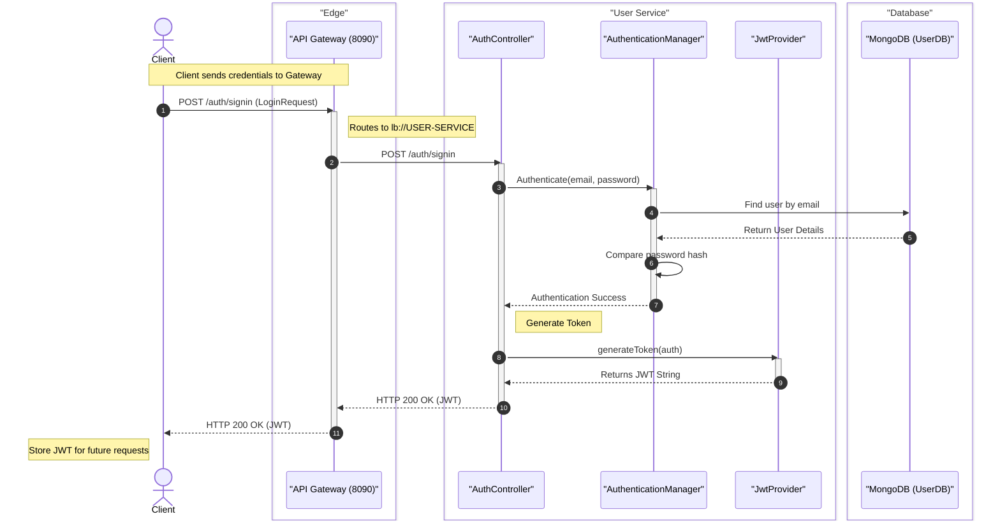
```mermaid
sequenceDiagram
    autonumber
    actor Client

box "Edge" #e1bee7
participant Gateway as "API Gateway (8090)"
end

box "User Service" #bbdefb
participant AuthCtrl as "AuthController"
participant AuthMgr as "AuthenticationManager"
participant JwtProv as "JwtProvider"
end

box "Database" #fff9c4
participant Mongo as "MongoDB (UserDB)"
end

Note over Client, Gateway: Client sends credentials to Gateway
Client->>Gateway: POST /auth/signin (LoginRequest)
activate Gateway
Note right of Gateway: Routes to lb://USER-SERVICE
Gateway->>AuthCtrl: POST /auth/signin
activate AuthCtrl

AuthCtrl->>AuthMgr: Authenticate(email, password)
activate AuthMgr
AuthMgr->>Mongo: Find user by email
Mongo-->>AuthMgr: Return User Details
AuthMgr->>AuthMgr: Compare password hash
AuthMgr-->>AuthCtrl: Authentication Success
deactivate AuthMgr

Note right of AuthCtrl: Generate Token
AuthCtrl->>JwtProv: generateToken(auth)
activate JwtProv
JwtProv-->>AuthCtrl: Returns JWT String
deactivate JwtProv

AuthCtrl-->>Gateway: HTTP 200 OK (JWT)
deactivate AuthCtrl
Gateway-->>Client: HTTP 200 OK (JWT)
deactivate Gateway

Note left of Client: Store JWT for future requests
```

---

### 3. Sequence Diagram: Secured Cross-Service Flow (Admin Creates Task)

This diagram shows a complex flow where one service (`TASK-SERVICE`) must authorize an action based on data owned by another service (`USER-SERVICE`).

* **Scenario:** An Admin tries to create a task.
* **Route:** `Gateway -> TASK-SERVICE`.
* **Inter-Service:** `TASK-SERVICE -> USER-SERVICE` (via Feign) to check the role.

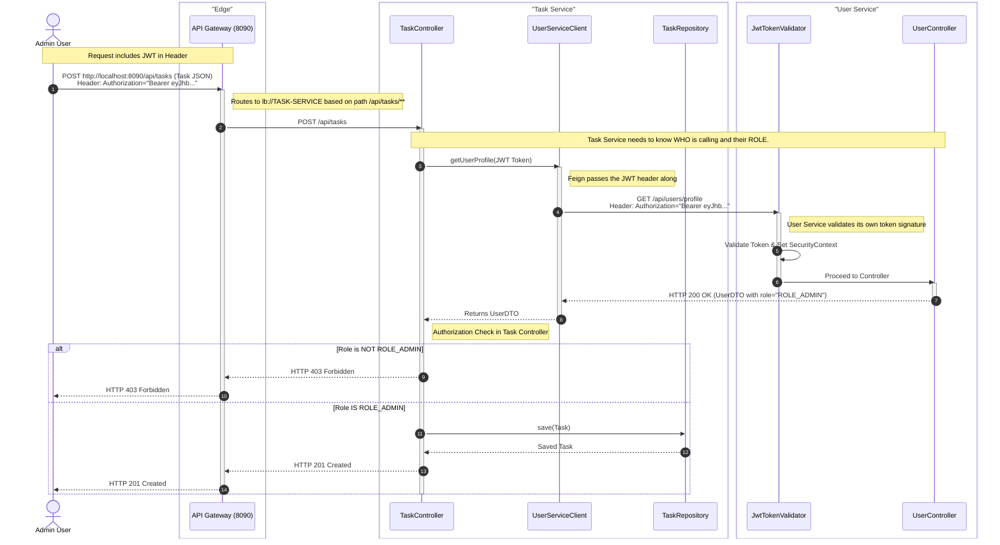
```mermaid
sequenceDiagram
    autonumber
    actor Client as Admin User
    box "Edge" #e1bee7
    participant Gateway as API Gateway (8090)
    end
    box "Task Service" #f8bbd0
    participant TaskCtrl as TaskController
    participant UserFeign as UserServiceClient
    participant TaskRepo as TaskRepository
    end
    box "User Service" #bbdefb
    participant JwtFilter as JwtTokenValidator
    participant UserCtrl as UserController
    end

    Note over Client, Gateway: Request includes JWT in Header
    Client->>Gateway: POST http://localhost:8090/api/tasks (Task JSON)<br/>Header: Authorization="Bearer eyJhb..."
    activate Gateway
    Note right of Gateway: Routes to lb://TASK-SERVICE based on path /api/tasks/**
    Gateway->>TaskCtrl: POST /api/tasks
    activate TaskCtrl

    Note over TaskCtrl, UserCtrl: Task Service needs to know WHO is calling and their ROLE.
    TaskCtrl->>UserFeign: getUserProfile(JWT Token)
    activate UserFeign
    Note right of UserFeign: Feign passes the JWT header along
    UserFeign->>JwtFilter: GET /api/users/profile<br/>Header: Authorization="Bearer eyJhb..."
    activate JwtFilter
    
    Note right of JwtFilter: User Service validates its own token signature
    JwtFilter->>JwtFilter: Validate Token & Set SecurityContext
    JwtFilter->>UserCtrl: Proceed to Controller
    deactivate JwtFilter
    activate UserCtrl
    UserCtrl-->>UserFeign: HTTP 200 OK (UserDTO with role="ROLE_ADMIN")
    deactivate UserCtrl
    UserFeign-->>TaskCtrl: Returns UserDTO
    deactivate UserFeign

    Note right of TaskCtrl: Authorization Check in Task Controller
    alt Role is NOT ROLE_ADMIN
        TaskCtrl-->>Gateway: HTTP 403 Forbidden
        Gateway-->>Client: HTTP 403 Forbidden
    else Role IS ROLE_ADMIN
        TaskCtrl->>TaskRepo: save(Task)
        TaskRepo-->>TaskCtrl: Saved Task
        TaskCtrl-->>Gateway: HTTP 201 Created
        Gateway-->>Client: HTTP 201 Created
    end
    deactivate TaskCtrl
    deactivate Gateway

```

---

### 4. Sequence Diagram: Multi-Service Workflow (Accept Submission & Complete Task)

This is the most complex flow in your system, involving three different microservices coordinating a business transaction.

* **Scenario:** An Admin accepts a user's submission. This must update the submission status *and* mark the corresponding task as "DONE".
* **Route:** `Gateway -> TASK-SUBMISSION-SERVICE`.
* **Inter-Service 1:** `SUBMISSION-SERVICE -> TASK-SERVICE` (to mark task complete).
* **Inter-Service 2 (Implicit):** Task Service call includes JWT, validated by User Service logic implicitly during the Feign call chain, though not explicitly drawn here to keep it readable.

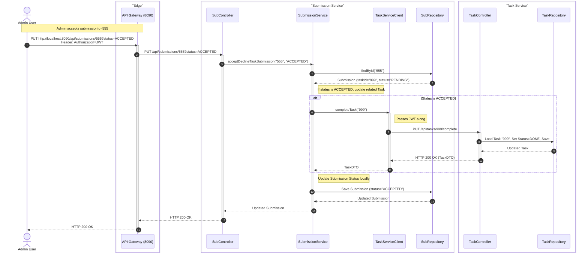
```mermaid
sequenceDiagram
    autonumber
    actor Client as Admin User
    box "Edge" #e1bee7
    participant Gateway as API Gateway (8090)
    end
    box "Submission Service" #c8e6c9
    participant SubCtrl as SubController
    participant SubSvc as SubmissionService
    participant TaskFeign as TaskServiceClient
    participant SubRepo as SubRepository
    end
    box "Task Service" #f8bbd0
    participant TaskCtrl as TaskController
    participant TaskRepo as TaskRepository
    end

    Note over Client, Gateway: Admin accepts submissionId=555
    Client->>Gateway: PUT http://localhost:8090/api/submissions/555?status=ACCEPTED<br/>Header: Authorization=JWT
    activate Gateway
    Gateway->>SubCtrl: PUT /api/submissions/555?status=ACCEPTED
    activate SubCtrl
    SubCtrl->>SubSvc: acceptDeclineTaskSubmission("555", "ACCEPTED")
    activate SubSvc
    
    SubSvc->>SubRepo: findById("555")
    SubRepo-->>SubSvc: Submission (taskId="999", status="PENDING")

    note right of SubSvc: If status is ACCEPTED, update related Task
    alt Status is ACCEPTED
        SubSvc->>TaskFeign: completeTask("999")
        activate TaskFeign
        note right of TaskFeign: Passes JWT along
        TaskFeign->>TaskCtrl: PUT /api/tasks/999/complete
        activate TaskCtrl
        TaskCtrl->>TaskRepo: Load Task "999", Set Status=DONE, Save
        TaskRepo-->>TaskCtrl: Updated Task
        TaskCtrl-->>TaskFeign: HTTP 200 OK (TaskDTO)
        deactivate TaskCtrl
        TaskFeign-->>SubSvc: TaskDTO
        deactivate TaskFeign
    end

    note right of SubSvc: Update Submission Status locally
    SubSvc->>SubRepo: Save Submission (status="ACCEPTED")
    SubRepo-->>SubSvc: Updated Submission
    SubSvc-->>SubCtrl: Updated Submission
    deactivate SubSvc
    SubCtrl-->>Gateway: HTTP 200 OK
    deactivate SubCtrl
    Gateway-->>Client: HTTP 200 OK
    deactivate Gateway

```
---

This is a robust `task-user-service` implemented using Spring Boot, Spring Security with JWT, MongoDB, and Resilience4j for fault tolerance. It handles user registration, authentication, and user profile management in a microservices architecture.

Here are the detailed architectural and sequence diagrams illustrating the key flows of your application.

---


### 1. High-Level Architecture Diagram (TaskUserService)

This diagram shows how the different components within your service interact to handle requests, from the initial API call to the database interaction.

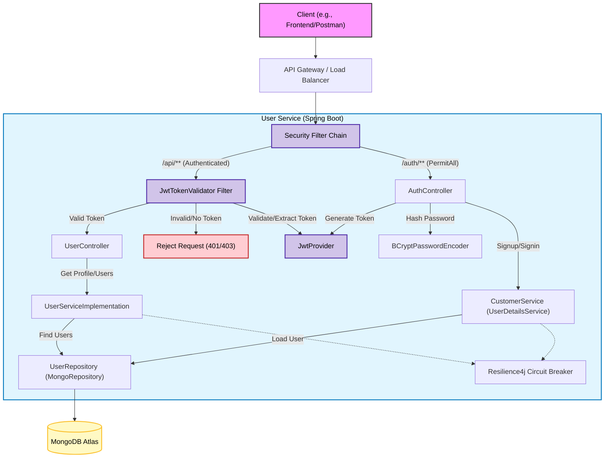
```mermaid
graph TD
    Client["Client (e.g., Frontend/Postman)"] --> API_Gateway["API Gateway / Load Balancer"]
    API_Gateway --> Security_Filter_Chain["Security Filter Chain"]

    subgraph ServiceContainer ["User Service (Spring Boot)"]
        Security_Filter_Chain -- "/auth/** (PermitAll)" --> Auth_Controller[AuthController]
        Security_Filter_Chain -- "/api/** (Authenticated)" --> Jwt_Token_Validator["JwtTokenValidator Filter"]

        Jwt_Token_Validator -- "Valid Token" --> User_Controller[UserController]
        Jwt_Token_Validator -- "Invalid/No Token" --> Reject["Reject Request (401/403)"]

        Auth_Controller -- "Signup/Signin" --> Customer_Service["CustomerService (UserDetailsService)"]
        User_Controller -- "Get Profile/Users" --> User_Service[UserServiceImplementation]

        Customer_Service -- "Load User" --> User_Repository["UserRepository (MongoRepository)"]
        User_Service -- "Find Users" --> User_Repository

        Auth_Controller -- "Generate Token" --> Jwt_Provider[JwtProvider]
        Jwt_Token_Validator -- "Validate/Extract Token" --> Jwt_Provider

        Auth_Controller -- "Hash Password" --> Password_Encoder[BCryptPasswordEncoder]

        Customer_Service -.-> Circuit_Breaker["Resilience4j Circuit Breaker"]
        User_Service -.-> Circuit_Breaker
    end

    User_Repository --> MongoDB[(MongoDB Atlas)]

    %% UNIVERSAL THEME STYLING
    style Client fill:#f9f,stroke:#333,stroke-width:2px,color:#000
    style MongoDB fill:#fff9c4,stroke:#fbc02d,stroke-width:2px,color:#000
    style ServiceContainer fill:#e1f5fe,stroke:#0277bd,stroke-width:2px,color:#000
    style Security_Filter_Chain fill:#d1c4e9,stroke:#512da8,stroke-width:2px,color:#000
    style Jwt_Token_Validator fill:#d1c4e9,stroke:#512da8,stroke-width:2px,color:#000
    style Jwt_Provider fill:#d1c4e9,stroke:#512da8,stroke-width:2px,color:#000
    style Reject fill:#ffcdd2,stroke:#c62828,stroke-width:2px,color:#000
```

---

### 2. Sequence Diagram: User Registration (`/auth/signup`)

This diagram details the process of a new user signing up, involving password hashing, database saving, and JWT generation.

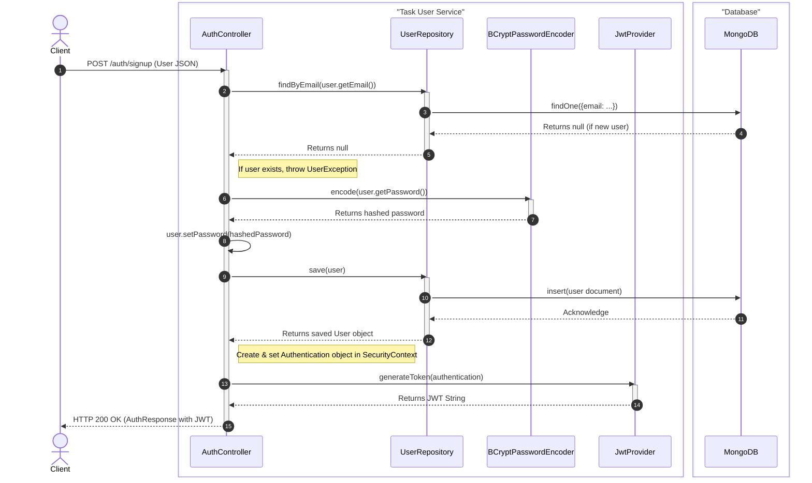
```mermaid
sequenceDiagram
    autonumber
    actor Client
    box "Task User Service" #e3f2fd
    participant AuthCtrl as AuthController
    participant Repo as UserRepository
    participant Encoder as BCryptPasswordEncoder
    participant JwtProv as JwtProvider
    end
    box "Database" #fff9c4
    participant Mongo as MongoDB
    end

    Client->>AuthCtrl: POST /auth/signup (User JSON)
    activate AuthCtrl
    
    AuthCtrl->>Repo: findByEmail(user.getEmail())
    activate Repo
    Repo->>Mongo: findOne({email: ...})
    Mongo-->>Repo: Returns null (if new user)
    Repo-->>AuthCtrl: Returns null
    deactivate Repo

    note right of AuthCtrl: If user exists, throw UserException

    AuthCtrl->>Encoder: encode(user.getPassword())
    activate Encoder
    Encoder-->>AuthCtrl: Returns hashed password
    deactivate Encoder
    
    AuthCtrl->>AuthCtrl: user.setPassword(hashedPassword)

    AuthCtrl->>Repo: save(user)
    activate Repo
    Repo->>Mongo: insert(user document)
    Mongo-->>Repo: Acknowledge
    Repo-->>AuthCtrl: Returns saved User object
    deactivate Repo

    note right of AuthCtrl: Create & set Authentication object in SecurityContext

    AuthCtrl->>JwtProv: generateToken(authentication)
    activate JwtProv
    JwtProv-->>AuthCtrl: Returns JWT String
    deactivate JwtProv

    AuthCtrl-->>Client: HTTP 200 OK (AuthResponse with JWT)
    deactivate AuthCtrl

```

---

### 3. Sequence Diagram: User Login (`/auth/signin`)

This flow shows how a user authenticates with their credentials to receive a JWT.

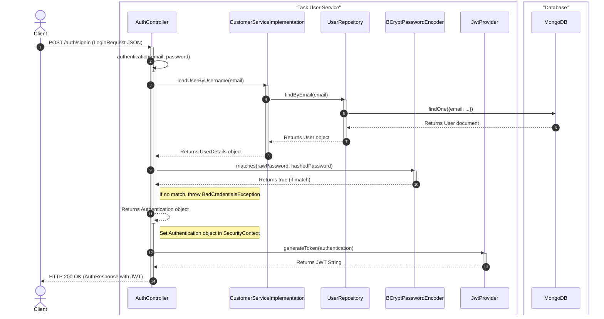
```mermaid
sequenceDiagram
    autonumber
    actor Client
    box "Task User Service" #e3f2fd
    participant AuthCtrl as AuthController
    participant CustSvc as CustomerServiceImplementation
    participant Repo as UserRepository
    participant Encoder as BCryptPasswordEncoder
    participant JwtProv as JwtProvider
    end
    box "Database" #fff9c4
    participant Mongo as MongoDB
    end

    Client->>AuthCtrl: POST /auth/signin (LoginRequest JSON)
    activate AuthCtrl
    
    AuthCtrl->>AuthCtrl: authentication(email, password)
    activate AuthCtrl
    
    AuthCtrl->>CustSvc: loadUserByUsername(email)
    activate CustSvc
    CustSvc->>Repo: findByEmail(email)
    activate Repo
    Repo->>Mongo: findOne({email: ...})
    Mongo-->>Repo: Returns User document
    Repo-->>CustSvc: Returns User object
    deactivate Repo
    
    CustSvc-->>AuthCtrl: Returns UserDetails object
    deactivate CustSvc

    AuthCtrl->>Encoder: matches(rawPassword, hashedPassword)
    activate Encoder
    Encoder-->>AuthCtrl: Returns true (if match)
    deactivate Encoder

    note right of AuthCtrl: If no match, throw BadCredentialsException
    
    AuthCtrl-->>AuthCtrl: Returns Authentication object
    deactivate AuthCtrl

    note right of AuthCtrl: Set Authentication object in SecurityContext

    AuthCtrl->>JwtProv: generateToken(authentication)
    activate JwtProv
    JwtProv-->>AuthCtrl: Returns JWT String
    deactivate JwtProv

    AuthCtrl-->>Client: HTTP 200 OK (AuthResponse with JWT)
    deactivate AuthCtrl

```

---

### 4. Sequence Diagram: Fetching User Profile (`/api/users/profile`)

This diagram illustrates a secured request where the `JwtTokenValidator` filter intercepts the request to validate the token before it reaches the controller.

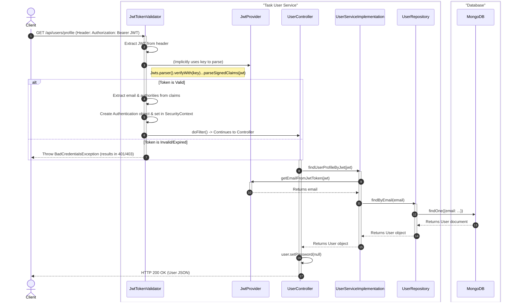
```mermaid
sequenceDiagram
    autonumber
    actor Client
    box "Task User Service" #e3f2fd
    participant Filter as JwtTokenValidator
    participant JwtProv as JwtProvider
    participant UserCtrl as UserController
    participant UserSvc as UserServiceImplementation
    participant Repo as UserRepository
    end
    box "Database" #fff9c4
    participant Mongo as MongoDB
    end

    Client->>Filter: GET /api/users/profile (Header: Authorization: Bearer JWT)
    activate Filter
    
    Filter->>Filter: Extract JWT from header
    
    Filter->>JwtProv: (Implicitly uses key to parse)
    note right of Filter: Jwts.parser().verifyWith(key)...parseSignedClaims(jwt)
    
    alt Token is Valid
        Filter->>Filter: Extract email & authorities from claims
        Filter->>Filter: Create Authentication object & set in SecurityContext
        Filter->>UserCtrl: doFilter() -> Continues to Controller
    else Token is Invalid/Expired
        Filter-->>Client: Throw BadCredentialsException (results in 401/403)
    end
    deactivate Filter

    activate UserCtrl
    UserCtrl->>UserSvc: findUserProfileByJwt(jwt)
    activate UserSvc
    
    UserSvc->>JwtProv: getEmailFromJwtToken(jwt)
    activate JwtProv
    JwtProv-->>UserSvc: Returns email
    deactivate JwtProv
    
    UserSvc->>Repo: findByEmail(email)
    activate Repo
    Repo->>Mongo: findOne({email: ...})
    Mongo-->>Repo: Returns User document
    Repo-->>UserSvc: Returns User object
    deactivate Repo
    
    UserSvc-->>UserCtrl: Returns User object
    deactivate UserSvc

    UserCtrl->>UserCtrl: user.setPassword(null)
    UserCtrl-->>Client: HTTP 200 OK (User JSON)
    deactivate UserCtrl

```
---
This is a well-structured microservice for managing tasks, integrated with a separate User Service via Feign Client.

Here are the architectural and sequence diagrams illustrating its core functionality, particularly how it handles cross-service communication and task management logic.

---

### 1. High-Level Architecture Diagram (TaskService)

This diagram shows the components of the `TASK-SERVICE` and its interaction with the external `USER-SERVICE` and the database.

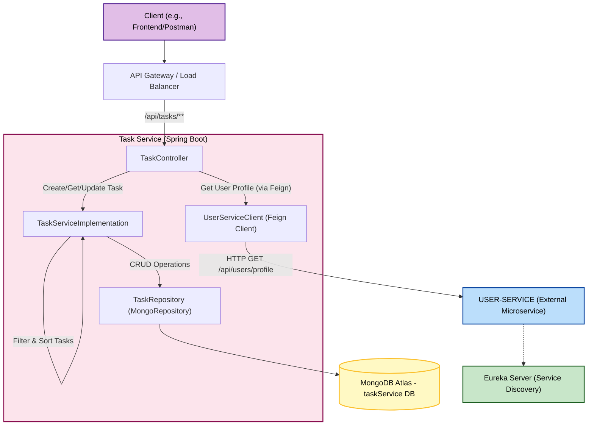
```mermaid
graph TD
    Client["Client (e.g., Frontend/Postman)"] --> API_Gateway["API Gateway / Load Balancer"]
    API_Gateway -- "/api/tasks/**" --> Task_Controller[TaskController]

    subgraph Task_Service_SB ["Task Service (Spring Boot)"]
        Task_Controller -- "Create/Get/Update Task" --> Task_Service[TaskServiceImplementation]
        Task_Service -- "CRUD Operations" --> Task_Repository["TaskRepository (MongoRepository)"]

        Task_Controller -- "Get User Profile (via Feign)" --> User_Feign_Client["UserServiceClient (Feign Client)"]

        Task_Service -- "Filter & Sort Tasks" --> Task_Service
    end

    User_Feign_Client -- "HTTP GET /api/users/profile" --> User_Service_App["USER-SERVICE (External Microservice)"]
    Task_Repository --> MongoDB[(MongoDB Atlas - taskService DB)]

    User_Service_App -.-> Eureka["Eureka Server (Service Discovery)"]

%% UNIVERSAL THEME STYLING
    style Client fill:#e1bee7,stroke:#4a148c,stroke-width:2px,color:#000
    style MongoDB fill:#fff9c4,stroke:#fbc02d,stroke-width:2px,color:#000
    style Task_Service_SB fill:#fce4ec,stroke:#880e4f,stroke-width:2px,color:#000
    style User_Service_App fill:#bbdefb,stroke:#0d47a1,stroke-width:2px,color:#000
    style Eureka fill:#c8e6c9,stroke:#1b5e20,stroke-width:2px,color:#000
```

**Key Interactions:**

1. **Client Request:** The client sends HTTP requests (POST, GET, PUT, DELETE) to the `TaskController`.
2. **User Validation (Inter-Service):** Before performing sensitive actions like creating a task, the `TaskController` uses the `UserServiceClient` (Feign) to call the `USER-SERVICE`. It passes the JWT token to fetch the user's profile and validate their role (e.g., checking for `ROLE_ADMIN`).
3. **Task Logic:** The `TaskController` delegates business logic to `TaskServiceImplementation`.
4. **Database interaction:** The service uses `TaskRepository` to interact with the MongoDB database for storing and retrieving task documents.

---

### 2. Sequence Diagram: Create Task Flow (with User Service Validation)

This diagram details the steps involved when a client requests to create a new task, highlighting the synchronous call to the User Service.

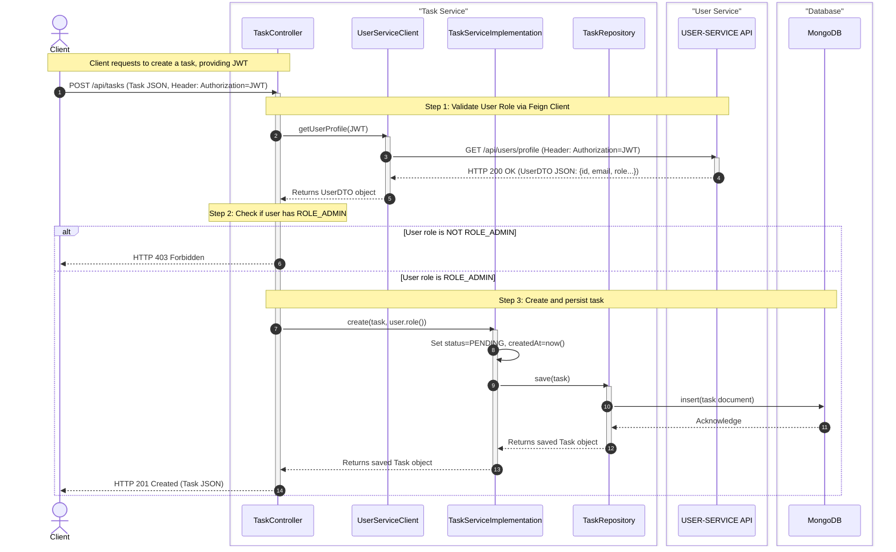
```mermaid
sequenceDiagram
    autonumber
    actor Client
    box "Task Service" #fff0f5
    participant TaskCtrl as TaskController
    participant FeignClient as UserServiceClient
    participant TaskSvc as TaskServiceImplementation
    participant TaskRepo as TaskRepository
    end
    box "User Service" #e1f5fe
    participant UserSvcApp as USER-SERVICE API
    end
    box "Database" #fff9c4
    participant Mongo as MongoDB
    end

    Note over Client, TaskCtrl: Client requests to create a task, providing JWT
    Client->>TaskCtrl: POST /api/tasks (Task JSON, Header: Authorization=JWT)
    activate TaskCtrl
    
    Note over TaskCtrl, UserSvcApp: Step 1: Validate User Role via Feign Client
    TaskCtrl->>FeignClient: getUserProfile(JWT)
    activate FeignClient
    FeignClient->>UserSvcApp: GET /api/users/profile (Header: Authorization=JWT)
    activate UserSvcApp
    UserSvcApp-->>FeignClient: HTTP 200 OK (UserDTO JSON: {id, email, role...})
    deactivate UserSvcApp
    FeignClient-->>TaskCtrl: Returns UserDTO object
    deactivate FeignClient

    Note over TaskCtrl: Step 2: Check if user has ROLE_ADMIN
    alt User role is NOT ROLE_ADMIN
        TaskCtrl-->>Client: HTTP 403 Forbidden
    else User role is ROLE_ADMIN
        Note over TaskCtrl, Mongo: Step 3: Create and persist task
        TaskCtrl->>TaskSvc: create(task, user.role())
        activate TaskSvc
        TaskSvc->>TaskSvc: Set status=PENDING, createdAt=now()
        TaskSvc->>TaskRepo: save(task)
        activate TaskRepo
        TaskRepo->>Mongo: insert(task document)
        Mongo-->>TaskRepo: Acknowledge
        TaskRepo-->>TaskSvc: Returns saved Task object
        deactivate TaskRepo
        TaskSvc-->>TaskCtrl: Returns saved Task object
        deactivate TaskSvc
        TaskCtrl-->>Client: HTTP 201 Created (Task JSON)
    end
    deactivate TaskCtrl

```

---

### 3. Sequence Diagram: Get Assigned Tasks (Filtering & Sorting)

This diagram shows how a user fetches tasks assigned to them, with optional filtering by status and sorting.

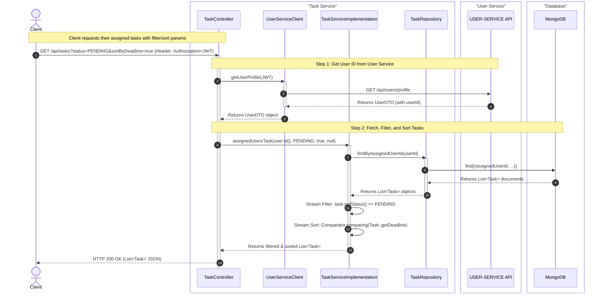
```mermaid
sequenceDiagram
    autonumber
    actor Client
    box "Task Service" #fff0f5
    participant TaskCtrl as TaskController
    participant FeignClient as UserServiceClient
    participant TaskSvc as TaskServiceImplementation
    participant TaskRepo as TaskRepository
    end
    box "User Service" #e1f5fe
    participant UserSvcApp as USER-SERVICE API
    end
    box "Database" #fff9c4
    participant Mongo as MongoDB
    end

    Note over Client, TaskCtrl: Client requests their assigned tasks with filter/sort params
    Client->>TaskCtrl: GET /api/tasks?status=PENDING&sortByDeadline=true (Header: Authorization=JWT)
    activate TaskCtrl

    Note over TaskCtrl, UserSvcApp: Step 1: Get User ID from User Service
    TaskCtrl->>FeignClient: getUserProfile(JWT)
    activate FeignClient
    FeignClient->>UserSvcApp: GET /api/users/profile
    UserSvcApp-->>FeignClient: Returns UserDTO (with userId)
    deactivate FeignClient
    FeignClient-->>TaskCtrl: Returns UserDTO object
    
    Note over TaskCtrl, Mongo: Step 2: Fetch, Filter, and Sort Tasks
    TaskCtrl->>TaskSvc: assignedUsersTask(user.id(), PENDING, true, null)
    activate TaskSvc
    TaskSvc->>TaskRepo: findByAssignedUserId(userId)
    activate TaskRepo
    TaskRepo->>Mongo: find({assignedUserId: ...})
    Mongo-->>TaskRepo: Returns List<Task> documents
    TaskRepo-->>TaskSvc: Returns List<Task> objects
    deactivate TaskRepo
    
    TaskSvc->>TaskSvc: Stream Filter: task.getStatus() == PENDING
    TaskSvc->>TaskSvc: Stream Sort: Comparator.comparing(Task::getDeadline)
    
    TaskSvc-->>TaskCtrl: Returns filtered & sorted List<Task>
    deactivate TaskSvc

    TaskCtrl-->>Client: HTTP 200 OK (List<Task> JSON)
    deactivate TaskCtrl

```
---
This is the `TASK-SUBMISSION-SERVICE`, a microservice responsible for handling task submissions from users. It interacts with both the `USER-SERVICE` (to get user details) and the `TASK-SERVICE` (to validate tasks and mark them as complete).

Here are the detailed architectural and sequence diagrams illustrating its core functionality.

---

### 1. High-Level Architecture Diagram (TaskSubmissionService)

This diagram shows the components of the `TASK-SUBMISSION-SERVICE` and its interaction with external services and the database.

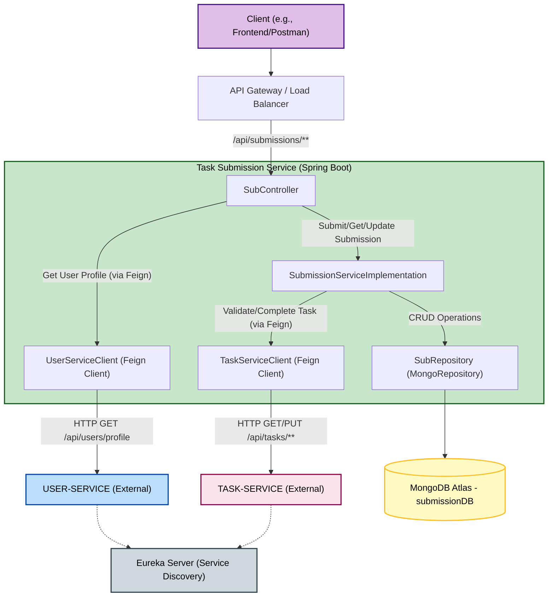
```mermaid
graph TD
    Client["Client (e.g., Frontend/Postman)"] --> API_Gateway["API Gateway / Load Balancer"]
    API_Gateway -- "/api/submissions/**" --> Sub_Controller[SubController]

    subgraph Sub_Service_SB ["Task Submission Service (Spring Boot)"]
        Sub_Controller -- "Submit/Get/Update Submission" --> Sub_Service[SubmissionServiceImplementation]
        Sub_Service -- "CRUD Operations" --> Sub_Repository["SubRepository (MongoRepository)"]

        Sub_Controller -- "Get User Profile (via Feign)" --> User_Feign_Client["UserServiceClient (Feign Client)"]
        Sub_Service -- "Validate/Complete Task (via Feign)" --> Task_Feign_Client["TaskServiceClient (Feign Client)"]
    end

    User_Feign_Client -- "HTTP GET /api/users/profile" --> User_Service_App["USER-SERVICE (External)"]
    Task_Feign_Client -- "HTTP GET/PUT /api/tasks/**" --> Task_Service_App["TASK-SERVICE (External)"]

    Sub_Repository --> MongoDB[(MongoDB Atlas - submissionDB)]

    User_Service_App -.-> Eureka["Eureka Server (Service Discovery)"]
    Task_Service_App -.-> Eureka

%% UNIVERSAL THEME STYLING
    style Client fill:#e1bee7,stroke:#4a148c,stroke-width:2px,color:#000
    style MongoDB fill:#fff9c4,stroke:#fbc02d,stroke-width:2px,color:#000
    style Sub_Service_SB fill:#c8e6c9,stroke:#1b5e20,stroke-width:2px,color:#000
    style User_Service_App fill:#bbdefb,stroke:#0d47a1,stroke-width:2px,color:#000
    style Task_Service_App fill:#fce4ec,stroke:#880e4f,stroke-width:2px,color:#000
    style Eureka fill:#cfd8dc,stroke:#37474f,stroke-width:2px,color:#000
```

**Key Interactions:**

1. **Client Request:** The client sends HTTP requests to the `SubController`.
2. **User Identity:** The `SubController` uses `UserServiceClient` to fetch the authenticated user's ID from the `USER-SERVICE` using the provided JWT.
3. **Task Validation & Update:** The `SubmissionServiceImplementation` uses `TaskServiceClient` to:
* Verify the existence of a task before allowing a submission.
* Call the `TASK-SERVICE` to mark a task as complete when a submission is accepted.


4. **Database:** `SubRepository` manages `TaskSubmission` documents in MongoDB.

---

### 2. Sequence Diagram: Submit a Task Flow

This diagram details the process of a user submitting a task, involving calls to both external services.

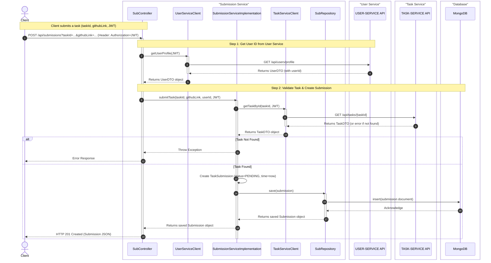
```mermaid
sequenceDiagram
    autonumber
    actor Client
    box "Submission Service" #e8f5e9
    participant SubCtrl as SubController
    participant UserFeign as UserServiceClient
    participant SubSvc as SubmissionServiceImplementation
    participant TaskFeign as TaskServiceClient
    participant SubRepo as SubRepository
    end
    box "User Service" #e1f5fe
    participant UserApp as USER-SERVICE API
    end
    box "Task Service" #fff0f5
    participant TaskApp as TASK-SERVICE API
    end
    box "Database" #fff9c4
    participant Mongo as MongoDB
    end

    Note over Client, SubCtrl: Client submits a task (taskId, githubLink, JWT)
    Client->>SubCtrl: POST /api/submissions?taskId=...&githubLink=... (Header: Authorization=JWT)
    activate SubCtrl

    Note over SubCtrl, UserApp: Step 1: Get User ID from User Service
    SubCtrl->>UserFeign: getUserProfile(JWT)
    activate UserFeign
    UserFeign->>UserApp: GET /api/users/profile
    UserApp-->>UserFeign: Returns UserDTO (with userId)
    deactivate UserFeign
    UserFeign-->>SubCtrl: Returns UserDTO object

    Note over SubCtrl, Mongo: Step 2: Validate Task & Create Submission
    SubCtrl->>SubSvc: submitTask(taskId, githubLink, userId, JWT)
    activate SubSvc
    
    SubSvc->>TaskFeign: getTaskById(taskId, JWT)
    activate TaskFeign
    TaskFeign->>TaskApp: GET /api/tasks/{taskId}
    TaskApp-->>TaskFeign: Returns TaskDTO (or error if not found)
    deactivate TaskFeign
    TaskFeign-->>SubSvc: Returns TaskDTO object

    alt Task Not Found
        SubSvc-->>SubCtrl: Throw Exception
        SubCtrl-->>Client: Error Response
    else Task Found
        SubSvc->>SubSvc: Create TaskSubmission (status=PENDING, time=now)
        SubSvc->>SubRepo: save(submission)
        activate SubRepo
        SubRepo->>Mongo: insert(submission document)
        Mongo-->>SubRepo: Acknowledge
        SubRepo-->>SubSvc: Returns saved Submission object
        deactivate SubRepo
        SubSvc-->>SubCtrl: Returns saved Submission object
        SubCtrl-->>Client: HTTP 201 Created (Submission JSON)
    end
    deactivate SubSvc
    deactivate SubCtrl

```

---

### 3. Sequence Diagram: Accept/Decline Submission Flow

This diagram shows the admin flow of accepting or rejecting a submission, which may trigger a task update in the `TASK-SERVICE`.

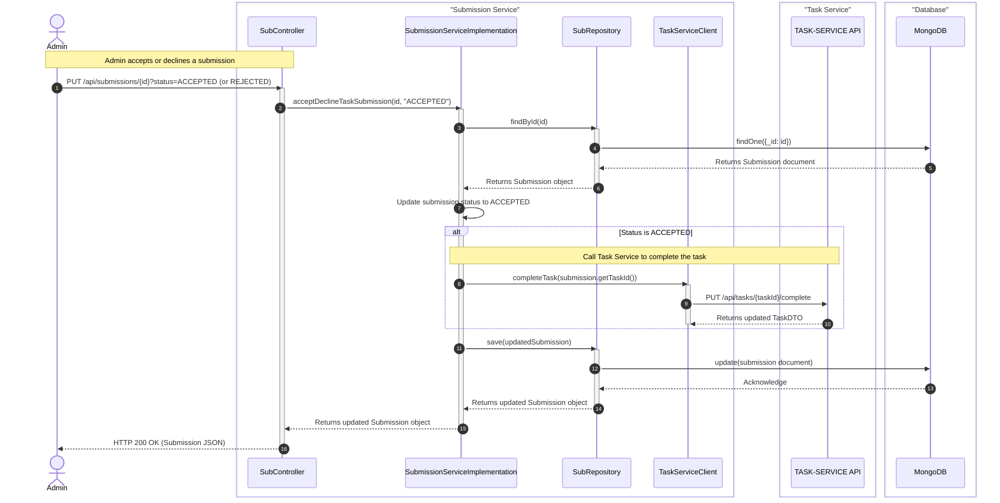
```mermaid
sequenceDiagram
    autonumber
    actor Client as Admin
    box "Submission Service" #e8f5e9
    participant SubCtrl as SubController
    participant SubSvc as SubmissionServiceImplementation
    participant SubRepo as SubRepository
    participant TaskFeign as TaskServiceClient
    end
    box "Task Service" #fff0f5
    participant TaskApp as TASK-SERVICE API
    end
    box "Database" #fff9c4
    participant Mongo as MongoDB
    end

    Note over Client, SubCtrl: Admin accepts or declines a submission
    Client->>SubCtrl: PUT /api/submissions/{id}?status=ACCEPTED (or REJECTED)
    activate SubCtrl

    SubCtrl->>SubSvc: acceptDeclineTaskSubmission(id, "ACCEPTED")
    activate SubSvc
    
    SubSvc->>SubRepo: findById(id)
    activate SubRepo
    SubRepo->>Mongo: findOne({_id: id})
    Mongo-->>SubRepo: Returns Submission document
    SubRepo-->>SubSvc: Returns Submission object
    deactivate SubRepo

    SubSvc->>SubSvc: Update submission status to ACCEPTED

    alt Status is ACCEPTED
        Note over SubSvc, TaskApp: Call Task Service to complete the task
        SubSvc->>TaskFeign: completeTask(submission.getTaskId())
        activate TaskFeign
        TaskFeign->>TaskApp: PUT /api/tasks/{taskId}/complete
        TaskApp-->>TaskFeign: Returns updated TaskDTO
        deactivate TaskFeign
    end

    SubSvc->>SubRepo: save(updatedSubmission)
    activate SubRepo
    SubRepo->>Mongo: update(submission document)
    Mongo-->>SubRepo: Acknowledge
    SubRepo-->>SubSvc: Returns updated Submission object
    deactivate SubRepo

    SubSvc-->>SubCtrl: Returns updated Submission object
    deactivate SubSvc

    SubCtrl-->>Client: HTTP 200 OK (Submission JSON)
    deactivate SubCtrl

```
---
This is the backbone of a Spring Cloud microservices architecture: the **Eureka Server** (Service Registry).

Unlike the previous services which hold business logic, this application's sole responsibility is to act as a dynamic phonebook. Other microservices register their locations (IP addresses and ports) here so they can find each other without hardcoding hostnames.

Based on the provided code and configuration, here are the architectural and sequence diagrams.

---

### 1. High-Level Architecture Diagram (EurekaServerService)

This diagram shows the Eureka Server's role as the central hub that other microservices connect to.

**Configuration Highlights based on your `application.yml`:**

* **Standalone Mode:** `register-with-eureka: false` and `fetch-registry: false` mean this server is acting alone, not as part of a cluster of Eureka peers.
* **Self Preservation Disabled:** `enable-self-preservation: false` means if clients stop sending heartbeats, Eureka will promptly remove them from the registry (common for development environments).

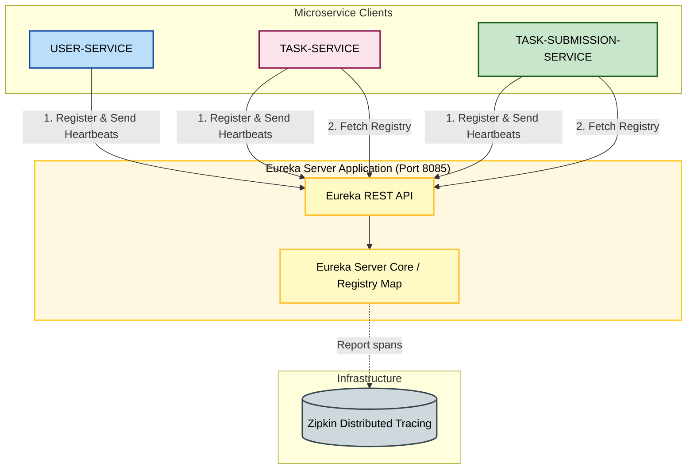
```mermaid
graph TD
    subgraph Infrastructure
        Zipkin[(Zipkin Distributed Tracing)]
    end

    subgraph Eureka_Sub ["Eureka Server Application (Port 8085)"]
        EurekaCore[Eureka Server Core / Registry Map]
        EurekaAPI[Eureka REST API]
    end

    subgraph Microservice_Clients ["Microservice Clients"]
        UserService["USER-SERVICE"]
        TaskService["TASK-SERVICE"]
        SubmissionService["TASK-SUBMISSION-SERVICE"]
    end

%% Registration flows
    UserService -- "1. Register & Send Heartbeats" --> EurekaAPI
    TaskService -- "1. Register & Send Heartbeats" --> EurekaAPI
    SubmissionService -- "1. Register & Send Heartbeats" --> EurekaAPI

%% Discovery flows
    TaskService -- "2. Fetch Registry" --> EurekaAPI
    SubmissionService -- "2. Fetch Registry" --> EurekaAPI

%% Internal
    EurekaAPI --> EurekaCore

%% Tracing
    EurekaCore -.->|"Report spans"| Zipkin

%% UNIVERSAL THEME STYLING
    style Zipkin fill:#cfd8dc,stroke:#37474f,stroke-width:2px,color:#000
    style EurekaCore fill:#fff9c4,stroke:#fbc02d,stroke-width:2px,color:#000
    style EurekaAPI fill:#fff9c4,stroke:#fbc02d,stroke-width:2px,color:#000
    style Eureka_Sub fill:#fff8e1,stroke:#ffca28,stroke-width:2px,color:#000
    style UserService fill:#bbdefb,stroke:#0d47a1,stroke-width:2px,color:#000
    style TaskService fill:#fce4ec,stroke:#880e4f,stroke-width:2px,color:#000
    style SubmissionService fill:#c8e6c9,stroke:#1b5e20,stroke-width:2px,color:#000
```

---

### 2. Sequence Diagram: Service Registration & Heartbeat

This diagram illustrates what happens when another microservice (like your `USER-SERVICE`) starts up. It must tell Eureka it exists and keep telling Eureka it's still alive.

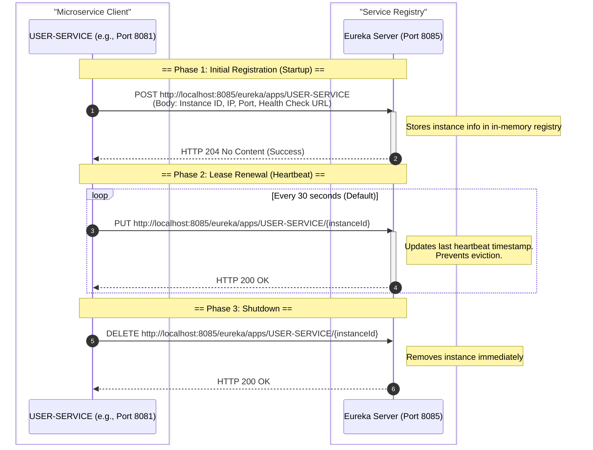
```mermaid
sequenceDiagram
    autonumber
    box "Microservice Client" #e1f5fe
    participant ClientApp as USER-SERVICE (e.g., Port 8081)
    end
    box "Service Registry" #fff8e1
    participant Eureka as Eureka Server (Port 8085)
    end

    Note over ClientApp, Eureka: == Phase 1: Initial Registration (Startup) ==
    ClientApp->>Eureka: POST http://localhost:8085/eureka/apps/USER-SERVICE<br/>(Body: Instance ID, IP, Port, Health Check URL)
    activate Eureka
    Note right of Eureka: Stores instance info in in-memory registry
    Eureka-->>ClientApp: HTTP 204 No Content (Success)
    deactivate Eureka

    Note over ClientApp, Eureka: == Phase 2: Lease Renewal (Heartbeat) ==
    loop Every 30 seconds (Default)
        ClientApp->>Eureka: PUT http://localhost:8085/eureka/apps/USER-SERVICE/{instanceId}
        activate Eureka
        Note right of Eureka: Updates last heartbeat timestamp.<br/>Prevents eviction.
        Eureka-->>ClientApp: HTTP 200 OK
        deactivate Eureka
    end

    Note over ClientApp, Eureka: == Phase 3: Shutdown ==
    ClientApp->>Eureka: DELETE http://localhost:8085/eureka/apps/USER-SERVICE/{instanceId}
    Note right of Eureka: Removes instance immediately
    Eureka-->>ClientApp: HTTP 200 OK

```

---

### 3. Sequence Diagram: Service Discovery (Fetching the Registry)

This diagram illustrates how one service uses Eureka to find another. For example, when `TASK-SERVICE` needs to call `USER-SERVICE` via Feign.

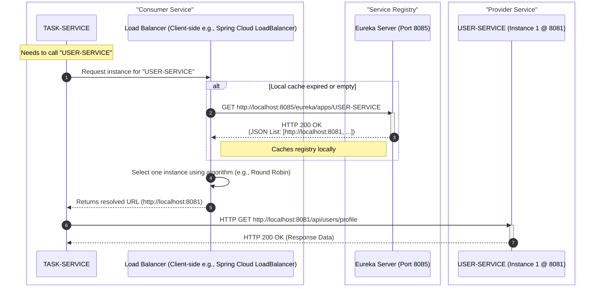
```mermaid
sequenceDiagram
    autonumber
    box "Consumer Service" #fff0f5
    participant Consumer as TASK-SERVICE
    participant LB as Load Balancer (Client-side e.g., Spring Cloud LoadBalancer)
    end
    box "Service Registry" #fff8e1
    participant Eureka as Eureka Server (Port 8085)
    end
    box "Provider Service" #e1f5fe
    participant Provider as USER-SERVICE (Instance 1 @ 8081)
    end

    Note over Consumer: Needs to call "USER-SERVICE"
    Consumer->>LB: Request instance for "USER-SERVICE"
    
    alt Local cache expired or empty
        LB->>Eureka: GET http://localhost:8085/eureka/apps/USER-SERVICE
        activate Eureka
        Eureka-->>LB: HTTP 200 OK<br/>(JSON List: [http://localhost:8081, ...])
        deactivate Eureka
        Note right of LB: Caches registry locally
    end

    LB->>LB: Select one instance using algorithm (e.g., Round Robin)
    LB-->>Consumer: Returns resolved URL (http://localhost:8081)

    Consumer->>Provider: HTTP GET http://localhost:8081/api/users/profile
    activate Provider
    Provider-->>Consumer: HTTP 200 OK (Response Data)
    deactivate Provider

```
---
This is the **API Gateway**, the single entry point for all clients (mobile, web, etc.) trying to access your microservices ecosystem.

Instead of clients needing to know the IP addresses and ports of the User, Task, and Submission services (ports 8081, 8082, 8083), they only need to know the Gateway's address (port **8090**). The gateway handles routing, load balancing, and cross-cutting concerns like CORS.

Here are the architectural and sequence diagrams illustrating its role.

---

### 1. High-Level Architecture Diagram (GatewayService)

This diagram shows the Gateway as the "front door" located between external clients and your internal backend network.

**Configuration Highlights based on your `application.yml`:**

* **Discovery Client:** It registers itself with Eureka and uses it to find other services (`lb://` prefix).
* **Routes:** It has explicit rules mapping URL paths (predicates) to service IDs.
* **Global CORS:** It handles Cross-Origin Resource Sharing headers centrally, allowing browsers to make requests to the backend.
* **WebMVC implementation:** You are using the Servlet-based (blocking) implementation of Spring Cloud Gateway, sitting on top of Tomcat, rather than the reactive WebFlux version.

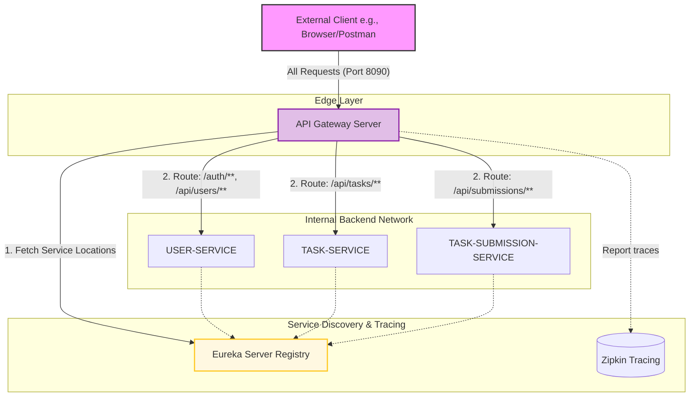
```mermaid
graph TD
    Client[External Client e.g., Browser/Postman] -- "All Requests (Port 8090)" --> Gateway

    subgraph "Edge Layer"
        Gateway[API Gateway Server]
    end

    subgraph "Service Discovery & Tracing"
        Eureka[Eureka Server Registry]
        Zipkin[(Zipkin Tracing)]
    end

    subgraph "Internal Backend Network"
        UserService[USER-SERVICE]
        TaskService[TASK-SERVICE]
        SubService[TASK-SUBMISSION-SERVICE]
    end

    %% Gateway interactions
    Gateway -- "1. Fetch Service Locations" --> Eureka
    Gateway -- "2. Route: /auth/**, /api/users/**" --> UserService
    Gateway -- "2. Route: /api/tasks/**" --> TaskService
    Gateway -- "2. Route: /api/submissions/**" --> SubService
    Gateway -.-> |"Report traces"| Zipkin

    %% Service interactions with Eureka (for context)
    UserService -.-> Eureka
    TaskService -.-> Eureka
    SubService -.-> Eureka

    style Gateway fill:#e1bee7,stroke:#8e24aa,stroke-width:2px
    style Eureka fill:#fff8e1,stroke:#ffca28,stroke-width:2px
    style Client fill:#f9f,stroke:#333,stroke-width:2px

```

---

### 2. Sequence Diagram: Request Routing Flow (e.g., Login)

This diagram illustrates the step-by-step process of how an incoming request is handled by the gateway. Let's take the example of a user trying to log in.

**Key Concept: `lb://` (Load Balancing):**
Because your URIs are defined as `lb://USER-SERVICE`, the gateway does **not** have hardcoded IP addresses. It asks Eureka for available instances and uses a client-side load balancer to pick one.

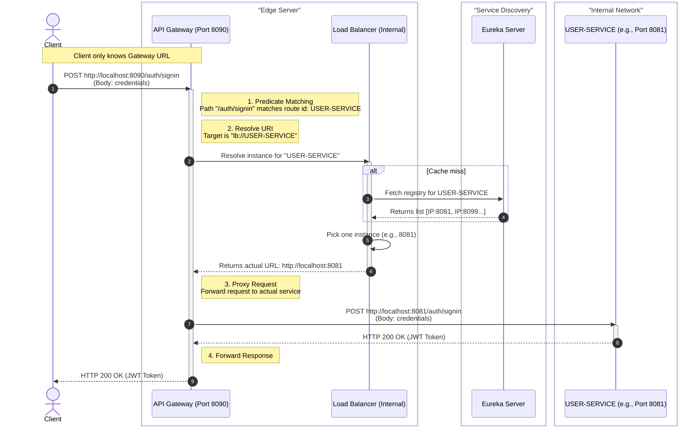
```mermaid
sequenceDiagram
    autonumber
    actor Client
    box "Edge Server" #e1bee7
    participant Gateway as API Gateway (Port 8090)
    participant LB as Load Balancer (Internal)
    end
    box "Service Discovery" #fff8e1
    participant Eureka as Eureka Server
    end
    box "Internal Network" #e1f5fe
    participant UserService as USER-SERVICE (e.g., Port 8081)
    end

    Note over Client, Gateway: Client only knows Gateway URL
    Client->>Gateway: POST http://localhost:8090/auth/signin<br/>(Body: credentials)
    activate Gateway

    Note right of Gateway: 1. Predicate Matching<br/>Path "/auth/signin" matches route id: USER-SERVICE

    Note right of Gateway: 2. Resolve URI<br/>Target is "lb://USER-SERVICE"
    Gateway->>LB: Resolve instance for "USER-SERVICE"
    activate LB
    
    alt Cache miss
        LB->>Eureka: Fetch registry for USER-SERVICE
        Eureka-->>LB: Returns list [IP:8081, IP:8099...]
    end
    
    LB->>LB: Pick one instance (e.g., 8081)
    LB-->>Gateway: Returns actual URL: http://localhost:8081
    deactivate LB

    Note right of Gateway: 3. Proxy Request<br/>Forward request to actual service
    Gateway->>UserService: POST http://localhost:8081/auth/signin<br/>(Body: credentials)
    activate UserService
    UserService-->>Gateway: HTTP 200 OK (JWT Token)
    deactivate UserService

    Note right of Gateway: 4. Forward Response
    Gateway-->>Client: HTTP 200 OK (JWT Token)
    deactivate Gateway

```
---

##  4. The 2026 Technology Stack

By looking at your `pom.xml` files, we can see you are using the "Bleeding Edge" of the Java ecosystem.

| Component | Technology | Version | Purpose |
| --- | --- | --- | --- |
| **Language** | **Java** | **25** | Utilizes the latest JVM performance improvements and Records. |
| **Framework** | **Spring Boot** | **4.0.2** | The newest foundation for high-performance microservices. |
| **Cloud Tools** | **Spring Cloud** | **2025.1.0** | Handles Discovery (Eureka), Routing (Gateway), and Feign. |
| **Security** | **JJWT** | **0.12.6** | Modern, immutable JWT creation and parsing. |
| **Observability** | **Micrometer Tracing, Zipkin** |**Latest**| Distributed tracing and performance monitoring across services.
| **Resilience** | **Resilience4j** | **2.0.2** | Circuit Breaking and fault tolerance. |

---

##  5. Deep-Dive: The "Magic" in the `pom.xml`

Your dependencies aren't just for features; they are for **Production-Grade Infrastructure**.

### **A. Observability (The Tracing Bridge)**

You have included `micrometer-tracing-bridge-brave` and `zipkin-reporter-brave` in every service.

* **Concept**: When a request starts at the Gateway, **Micrometer** creates a "Trace ID."
* **The Bridge**: **Brave** acts as the "Courier" that carries this ID through Feign headers across all services.
* **The Destination**: **Zipkin** collects these IDs so you can see a "movie" of the request's journey.

### **B. The JJWT 0.12 Suite**

In your `task-user-service`, you split JJWT into three parts: `jjwt-api`, `jjwt-impl`, and `jjwt-jackson`.

* **Why?** This is the **Service Provider Interface (SPI)** pattern. The `api` is what you code against, while `impl` and `jackson` provide the actual engine. This ensures that if Jackson (JSON parser) has a security bug, you can swap it without changing your code.

### **C. Gateway MVC vs. WebFlux**

Your Gateway uses `spring-cloud-starter-gateway-server-webmvc`.

* **Note**: In earlier years, the Gateway required "WebFlux" (Reactive). In 2026, Spring Cloud allows the **WebMVC** version, which is easier to debug and more compatible with standard Spring Security.


---


##  6. Global Concept Recall Table

| If you forget... | Look at this Service: | Why? |
| --- | --- | --- |
| **Security/JWT** | `task-user-service` | It's the only service that "signs" the tokens. |
| **Feign/Inter-service** | `task-submission-service` | It orchestrates calls between two other services. |
| **Routing/CORS** | `api-gateway-server` | It's the single entry point for the entire React app. |
| **Registry/Ports** | `eureka-server-configuration` | It lists where every service is currently "living." |


---

## 7. Key Features & Design Patterns

* **Service Discovery:** Services register with Eureka, allowing for horizontal scaling without hardcoding IPs.
* **Declarative Communication:** Used **OpenFeign** for clean, interface-based service-to-service calls.
* **Fault Tolerance:** Implemented the **Circuit Breaker** pattern to prevent cascading failures across the system.
* **Distributed Tracing:** Integrated **Zipkin** to visualize request latency and service dependencies.
* **Security:** Stateless authentication using JWT passed through headers for all secured endpoints.

---

## 8. Getting Started

### 1. Prerequisites

* JDK 25
* MongoDB (Local or Atlas)
* Zipkin Server (`java -jar zipkin.jar`)

### 2. Startup Order
Because these services are a "web" of dependencies, you **must** start them in this exact order:

1. **Infrastructure First**:
    * **MongoDB Atlas**: Ensure your cloud cluster is active.
    * **Zipkin Server**: Run the Zipkin Docker or JAR file (`http://localhost:9411`).


2. **The Naming Server**:
    * **Eureka Server** (Port `8085`): Start to allow other services to register. Wait until you can access the dashboard.


3. **The Guard**:
    * **API Gateway** (Port `8090`): It needs Eureka to know where to route traffic.


4. **The Domain Services**:
    * Start `User-Service`, `Task-Service`, and `Task-Submission-Service`.
        * **User Service** -> **Task Service** -> **Submission Service**.


| Step | Service | Port | Purpose |
| --- | --- | --- | --- |
| **1** | **Zipkin Server** | `9411` | Start this first so all services can send their traces immediately. |
| **2** | **Eureka Server** | `8085` | The "Phonebook" must be open before any "Subscribers" can join. |
| **3** | **API Gateway** | `8090` | The "Guard" needs to connect to Eureka to prepare for routing. |
| **4** | **User Service** | `8081` | The "Identity Provider" must be up for other services to validate tokens. |
| **5** | **Business Services** | `8082 & 8083` | Start Task and Submission services last. |


---


### **3. Health Check: The "Green Room" (Eureka Dashboard)**

Before testing APIs, open your browser to `http://localhost:8085`.

* **Success Criteria:** You should see all five services listed under "Instances currently registered with Eureka."
* **Troubleshooting:** If a service is missing, check its `application.yaml` to ensure the `defaultZone` URL matches the Eureka Server port exactly.

---


### **4. Advanced Debugging: Distributed Tracing (Zipkin)**
We use Zipkin to visualize the lifecycle of a request. Below is a trace of a cross-service communication:

<div align="center">
  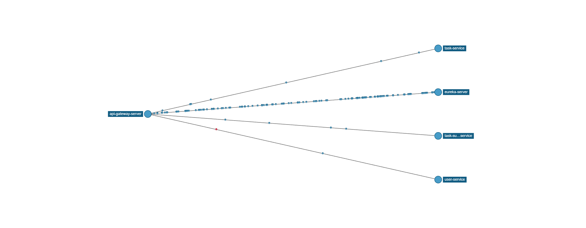
  <br>
  <p><i>Figure: Request latency breakdown across User and Task services</i></p>
</div>


If a request feels slow, don't guess—look at the trace.

1. Open `http://localhost:9411`.
2. Click "Run Query."
3. Find your `POST /api/submissions` request.
4. **Visual Learning:** You will see a "Gantt Chart" showing exactly how many milliseconds were spent in the Gateway, how many in the Submission Service, and how many were spent waiting for the Feign call to the Task Service.

### How to Read a Zipkin Trace

When a request hits the **API Gateway**, a unique `X-B3-TraceId` is generated to track the request across your microservices.

In Zipkin, look for a trace containing **3 spans** to understand the request flow:

| Span | Service | Description |
| :--- | :--- | :--- |
| **Span 1** | **Gateway** | Represents the **Total Latency** (the total time the user waited for a response). |
| **Span 2** | **Submission Service** | Represents the time spent inside the Submission Service processing business logic. |
| **Span 3** | **Task Service** | Represents the time spent in the **Feign Client** call to update the task status. |

###  Identifying Bottlenecks
* **Analyze Proportions:** If **Span 3** accounts for **90%** of the total time in Span 1, the bottleneck is located in the **Task Service** (likely due to database latency or resource contention).
* **Trace Flow:** Use these spans to visualize how data moves from the Gateway through your `task_submission_service` and finally to the `task-service`.

---

This section of your **Root README** is the most practical part for day-to-day work. It acts as a "Testing Hub," allowing you to verify that every service is correctly wired, secured, and communicating.

---

## 9.  Master Testing Guide: Endpoint Reference

To test the full system, always route your requests through the **API Gateway (`8090`)**. This ensures you are testing the load balancer, security filters, and inter-service Feign calls all at once.

---

###  1. User Microservice (Port: 8081 | Gateway: 8090)

**Role:** Authentication, User Profiles, and JWT Generation.

| Feature | Method | Endpoint | Body / Header | Notes |
| --- | --- | --- | --- | --- |
| **User Signup** | `POST` | `/auth/signup` | `{ "email", "password", "fullName", "role" }` | Returns JWT. Use `ROLE_ADMIN` for full access. |
| **User Login** | `POST` | `/auth/signin` | `{ "email", "password" }` | Returns JWT. Necessary for all other requests. |
| **Get My Profile** | `GET` | `/api/users/profile` | `Authorization: Bearer <JWT>` | Tests JWT extraction and persistence. |
| **Find User ID** | `GET` | `/api/users/{userId}` | `Authorization: Bearer <JWT>` | Used by Task Service via Feign. |
| **List All Users** | `GET` | `/api/users/all` | `Authorization: Bearer <JWT>` | Admin view of all registered users. |

---

###  2. Task Microservice (Port: 8082 | Gateway: 8090)

**Role:** Creating and managing the task lifecycle.

| Feature | Method | Endpoint | Body / Header | Notes |
| --- | --- | --- | --- | --- |
| **Create Task** | `POST` | `/api/tasks` | `{ "title", "description", "deadline" }` | **Admin Only.** Calls User Service to check role. |
| **Get All Tasks** | `GET` | `/api/tasks` | `Params: ?status=PENDING` | Tests Stream filtering and sorting. |
| **Assign Task** | `PUT` | `/api/tasks/{id}/user/{uId}/assigned` | `Authorization: Bearer <JWT>` | Links a Task ID to a User ID. |
| **Update Task** | `PUT` | `/api/tasks/{id}` | `{ "title", "status" }` | Allows partial updates to task metadata. |
| **Delete Task** | `DELETE` | `/api/tasks/{id}` | `Authorization: Bearer <JWT>` | Returns `204 No Content`. |

---

###  3. Submission Microservice (Port: 8083 | Gateway: 8090)

**Role:** Tracking work completion and cross-service status sync.

| Feature | Method | Endpoint | Body / Header | Notes |
| --- | --- | --- | --- | --- |
| **Submit Task** | `POST` | `/api/submissions` | `Params: taskId, githubLink` | **Multi-Hop:** Calls User Service AND Task Service. |
| **List Submissions** | `GET` | `/api/submissions` | `Authorization: Bearer <JWT>` | Shows all proof-of-work links. |
| **Task History** | `GET` | `/api/submissions/task/{tId}` | `Authorization: Bearer <JWT>` | Sees all attempts for a single task. |
| **Approve/Decline** | `PUT` | `/api/submissions/{id}` | `Params: ?status=ACCEPTED` | **Sync Call:** If Accepted, tells Task Service to mark as `DONE`. |

---

###  4. Infrastructure Dashboard (Internal Use)

These endpoints are used to verify the "Health" of the cluster.

| Service | Endpoint | Purpose |
| --- | --- | --- |
| **Eureka UI** | `http://localhost:8085` | Check if all 4 services are "UP" and registered. |
| **Zipkin UI** | `http://localhost:9411` | Visualize the latency of a Feign call from Submission to Task. |
| **Actuator** | `/actuator/health` | Standard health check (run on any service port). |
| **Gateway Routes** | `/actuator/gateway/routes` | Verify the Gateway is correctly mapping `/api/tasks` to the right port. |

---

## 10.  The "Master Recall" Testing Flow

If you want to test the **entire system** in 5 minutes, follow this sequence in Postman:

1. **Identity:** Signup a User as `ROLE_ADMIN` and copy the JWT.
2. **Resource:** `POST` a Task through the Gateway using that JWT.
3. **Assignment:** `PUT` the task to assign it to your own User ID.
4. **Work:** `POST` a Submission with a Github link.
5. **Completion:** `PUT` the submission status to `ACCEPTED`.
6. **Verification:** `GET` the task by ID and verify the status is now automatically `DONE`.

> **Recall Note:** If the last step shows `DONE`, your **OpenFeign** communication is working perfectly across all three service databases.

---
This is a comprehensive **Postman Collection** in JSON format. You can copy the code block below, save it as a file named `task_management.json`, and import it directly into Postman.

It is pre-configured with **Postman Variables**, so once you log in, the token is automatically saved and applied to every other request.

---

### **Postman Collection (JSON Import)**

```json
{
  "info": {
    "name": "Task Management Microservices (2026)",
    "schema": "https://schema.getpostman.com/json/collection/v2.1.0/collection.json"
  },
  "item": [
    {
      "name": "1. User Service (Auth)",
      "item": [
        {
          "name": "User Signup",
          "request": {
            "method": "POST",
            "header": [],
            "body": {
              "mode": "raw",
              "raw": "{\n    \"email\": \"admin@task.com\",\n    \"password\": \"password123\",\n    \"fullName\": \"Mahesh Admin\",\n    \"role\": \"ROLE_ADMIN\",\n    \"mobile\": \"9876543210\"\n}",
              "options": { "raw": { "language": "json" } }
            },
            "url": "http://localhost:8090/auth/signup"
          }
        },
        {
          "name": "User Login",
          "event": [
            {
              "listen": "test",
              "script": {
                "exec": [
                  "var jsonData = pm.response.json();",
                  "pm.environment.set(\"jwt_token\", jsonData.jwt);"
                ],
                "type": "text/javascript"
              }
            }
          ],
          "request": {
            "method": "POST",
            "header": [],
            "body": {
              "mode": "raw",
              "raw": "{\n    \"email\": \"admin@task.com\",\n    \"password\": \"password123\"\n}",
              "options": { "raw": { "language": "json" } }
            },
            "url": "http://localhost:8090/auth/signin"
          }
        },
        {
          "name": "Get My Profile",
          "request": {
            "method": "GET",
            "header": [
              { "key": "Authorization", "value": "Bearer {{jwt_token}}", "type": "text" }
            ],
            "url": "http://localhost:8090/api/users/profile"
          }
        }
      ]
    },
    {
      "name": "2. Task Service",
      "item": [
        {
          "name": "Create Task",
          "request": {
            "method": "POST",
            "header": [
              { "key": "Authorization", "value": "Bearer {{jwt_token}}", "type": "text" }
            ],
            "body": {
              "mode": "raw",
              "raw": "{\n    \"title\": \"Implement Microservices Architecture\",\n    \"description\": \"Set up Eureka, Gateway, and Feign Clients\",\n    \"deadline\": \"2026-12-31T23:59:59\",\n    \"tags\": [\"Spring Boot\", \"Microservices\"]\n}",
              "options": { "raw": { "language": "json" } }
            },
            "url": "http://localhost:8090/api/tasks"
          }
        },
        {
          "name": "Assign Task to User",
          "request": {
            "method": "PUT",
            "header": [
              { "key": "Authorization", "value": "Bearer {{jwt_token}}", "type": "text" }
            ],
            "url": {
              "path": ["api", "tasks", "{{task_id}}", "user", "{{user_id}}", "assigned"],
              "host": ["http://localhost:8090"]
            }
          }
        }
      ]
    },
    {
      "name": "3. Submission Service",
      "item": [
        {
          "name": "Submit Task (Work)",
          "request": {
            "method": "POST",
            "header": [
              { "key": "Authorization", "value": "Bearer {{jwt_token}}", "type": "text" }
            ],
            "url": {
              "raw": "http://localhost:8090/api/submissions?taskId={{task_id}}&githubLink=https://github.com/mahesh/project",
              "host": ["http://localhost:8090"],
              "path": ["api", "submissions"],
              "query": [
                { "key": "taskId", "value": "{{task_id}}" },
                { "key": "githubLink", "value": "https://github.com/mahesh/project" }
              ]
            }
          }
        },
        {
          "name": "Accept Submission (Admin)",
          "request": {
            "method": "PUT",
            "header": [
              { "key": "Authorization", "value": "Bearer {{jwt_token}}", "type": "text" }
            ],
            "url": {
              "raw": "http://localhost:8090/api/submissions/{{submission_id}}?status=ACCEPTED",
              "host": ["http://localhost:8090"],
              "path": ["api", "submissions", "{{submission_id}}"],
              "query": [
                { "key": "status", "value": "ACCEPTED" }
              ]
            }
          }
        }
      ]
    }
  ]
}

```

---

### **How to use this for testing:**

1. **Environment Setup:** In Postman, create an **Environment** and add a variable named `jwt_token`.
2. **Authentication:** Run the **User Login** request. The "Tests" script I included will automatically extract the JWT from the response and save it to your environment.
3. **Automatic Headers:** All subsequent requests are configured to use `{{jwt_token}}`. You don't need to copy-paste anything!
4. **The "Chain" Verification:** *
* After you run **Accept Submission**, run the **Get Task By ID** request again.
* You should see the task status has changed to `DONE` without you ever calling the Task Service manually. This proves your **Feign Client** and **Submission Logic** are perfectly synced.


---
## 11. Common Issues & Quick Fixes

| Issue | Potential Cause | Solution |
| :--- | :--- | :--- |
| **401 Unauthorized at Gateway** | Expired JWT or Secret Key Mismatch | Refresh your token or ensure the `SECRET_KEY` in **User-Service** matches your local testing tool configuration. |
| **Feign Call Returns 404** | Service Registration Failure | Check the **Eureka Dashboard**. Verify that the target service is running and properly registered. |
| **Zipkin Traces are Empty** | Startup Order Issue | Ensure the **Zipkin Server** is fully started before launching the microservices; they only connect to the collector during startup. |

---


##  Docker & Microservices Orchestration

This project is fully containerized using **Docker** and orchestrated with **Docker Compose**. This ensures the entire ecosystem—including the databases and tracing tools—can be started with a single command, maintaining environment consistency.

###  Infrastructure Overview

* **Container Runtime:** Docker (Eclipse Temurin Java 25 JRE Alpine)
* **Orchestration:** Docker Compose V2
* **Service Discovery:** Netflix Eureka
* **API Gateway:** Spring Cloud Gateway (Port 8090)
* **Observability:** OpenZipkin (Distributed Tracing)

---

###  Container Structure

Each microservice contains a multi-stage `Dockerfile` optimized for size using the Alpine Linux distribution.

| Service | Port | Responsibility |
| --- | --- | --- |
| `EUREKA-SERVER` | 8085 | Service Registry & Discovery |
| `API-GATEWAY` | 8090 | Routing, Load Balancing & CORS |
| `USER-SERVICE` | 8081 | Auth, JWT & Profile Management |
| `TASK-SERVICE` | 8082 | Task CRUD & User Assignment |
| `SUBMISSION-SERVICE` | 8083 | Task Submissions & Approval Workflow |
| `ZIPKIN` | 9411 | Distributed Tracing UI |

---

### How to Run the Entire System

#### 1. Prerequisites

* Docker Desktop installed and running.
* Maven installed.
* MongoDB Atlas cluster (or a local MongoDB instance).

#### 2. Environment Setup

Create a `.env` file in the root directory to securely store your database credentials:

```properties
USER_SERVICE_DB=mongodb+srv://<user>:<password>@cluster.mongodb.net/userDB
TASK_SERVICE_DB=mongodb+srv://<user>:<password>@cluster.mongodb.net/taskDB
SUBMISSION_SERVICE_DB=mongodb+srv://<user>:<password>@cluster.mongodb.net/subDB

```

#### 3. Build and Start

Run the following commands in the project root:

```bash
# Compile all services and skip tests for faster build
mvn clean package -DskipTests

# Build and start all containers in the background
docker-compose up --build -d

```

#### 4. Verification

* **Eureka Dashboard:** `http://localhost:8085` (Check if all 5 services are "UP")
* **Zipkin Tracing:** `http://localhost:9411` (View request latency graphs)
* **API Gateway:** All requests should be sent to `http://localhost:8090`

---

###  Troubleshooting & Logs

If a specific service is not appearing in Zipkin or Eureka, you can inspect the live logs:

```bash
# View logs for a specific service
docker logs -f user-service

# Restart the gateway if routes are not loading
docker restart api-gateway

```

###  Why Java 25 & Docker?

* **Java 25 (LTS):** Utilizes the latest performance enhancements and Virtual Threads for high-concurrency request handling.
* **Alpine Images:** Reduced the base image size from ~300MB to ~80MB, ensuring faster deployment and lower memory overhead.
* **Service Networking:** Used Docker's internal DNS (e.g., `http://zipkin:9411`) to decouple services from host machine IP addresses.

---


